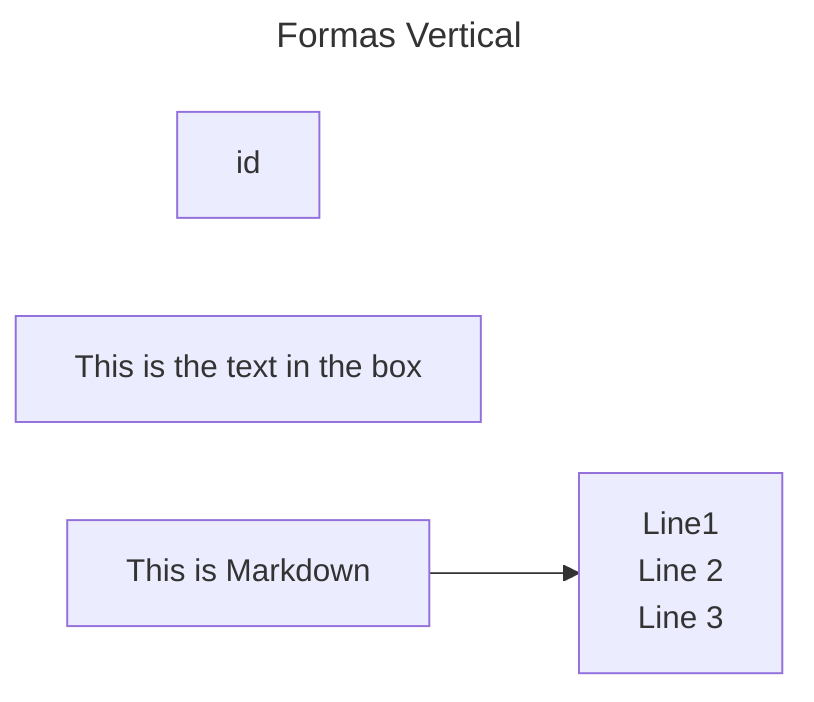

# Título 1
# Título 2
# Título 3.1.1
# Título 4.1.1
# Título 5.1.1
# Título 6

```mermaid
---
title: Formas Vertical
---
flowchart LR

    id

    id1[This is the text in the box]
    
    markdown[This is Markdown]
    newLines[Line1
    Line 2
    Line 3]
    markdown --> newLines
```

```mermaid
---
title: Formas Horizontal
---
flowchart TD
    inicio[Inicio]
    id1{This is the text in the box}
    id2[SI]
    id3[NO]
    inicio --> id1
    id1 --> id2
    id1 --> id3

        A@{ shape: manual-file, label: "File Handling"}
    B@{ shape: manual-input, label: "User Input"}
    C@{ shape: docs, label: "Multiple Documents"}
    D@{ shape: procs, label: "Process Automation"}
    E@{ shape: paper-tape, label: "Paper Records"}
```

