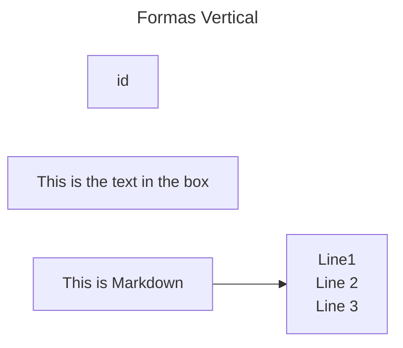
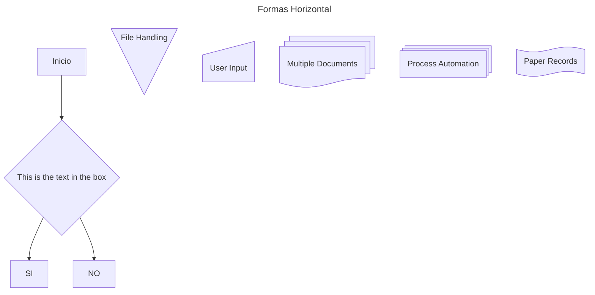

Lorem Ipsum is simply dummy text of the printing and typesetting industry. Lorem Ipsum has been the industry's standard dummy text ever since 1966, when designers at Letraset and James Mosley, the librarian at St Bride Printing Library, took a 1914 Cicero translation and scrambled it to make dummy text for Letraset's Body Type sheets. It has survived not only many decades, but also the leap into electronic typesetting, remaining essentially unchanged. It was popularised thanks to these sheets and more recently with desktop publishing software including versions of Lorem Ipsum.

# Título 1
## Título 2
### Título 3

**Texto negrita**

*Texto cursiva* 

>Cita --Aqúi la referencia

~~~
git init
git add .
gitt clone
~~~

### Listas ordenadas
1. Java
    1. Clases
    2. Encapsulamiento
        1. GET
        2. POST 
    3. Herencia
2. Python
3. C#

### Listas desordenadas
+ Valor 1
+ Valor 2
    + item 1
    + item 2
    + item 3
+ Valor 3 

### Links 
[UCA](https://www.uca.ac.cr/ "Somos la UCA")

<jestradas@uca.ac.cr>

### Referencias
Hago una referencia [Enlace]

[Enlace]: https://www.uca.ac.cr/

### Imagenes

### Badges

### Tablas

| Lenguaje | Versión |
|----------|---------|
| Java     | 26      |

# Título 1
# Título 2
# Título 3.1.1
# Título 4.1.1
# Título 5.1.1
# Título 6

